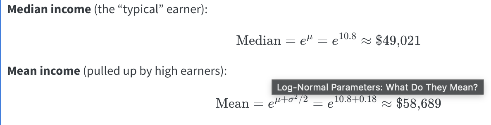
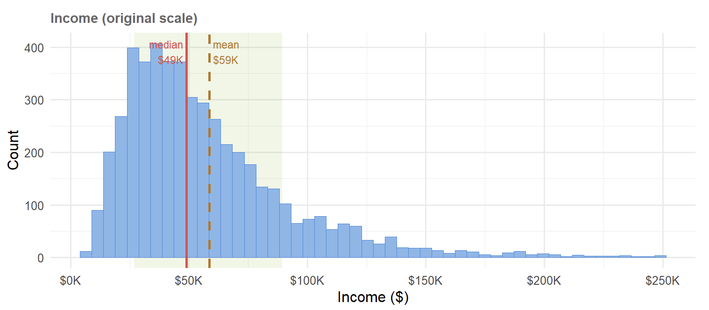

# Video Quizzes

```{r setup}
library(tidyverse)


# Recreate the direct-mail dataset used throughout the course
set.seed(123)
n <- 3000

mail_data <- tibble(
  customer_id = paste0("C", str_pad(1:n, 5, pad = "0")),
  age = round(rnorm(n, mean = 45, sd = 12)),
  income = round(rlnorm(n, meanlog = 10.8, sdlog = 0.6)),
  recency_days = round(rexp(n, rate = 1 / 60)),
  freq_12mo = rpois(n, lambda = 3),
  avg_order_amt = round(rlnorm(n, meanlog = 4.2, sdlog = 0.5), 2),
  channel = sample(
    c("email", "direct_mail", "digital"),
    n,
    replace = TRUE,
    prob = c(0.5, 0.3, 0.2)
  ),
  region = sample(
    c("West", "South", "Midwest", "Northeast"),
    n,
    replace = TRUE
  ),
  loyalty_tier = sample(
    c("Bronze", "Silver", "Gold", "Platinum"),
    n,
    replace = TRUE,
    prob = c(0.4, 0.3, 0.2, 0.1)
  ),
  responded = rbinom(
    n,
    1,
    prob = plogis(
      -3 +
        0.02 * (age - 45) +
        0.3 * log(income / 50000) +
        0.1 * freq_12mo -
        0.005 * recency_days
    )
  )
) |>
  mutate(
    income = if_else(runif(n) < 0.08, NA_real_, income),
    avg_order_amt = if_else(runif(n) < 0.05, NA_real_, avg_order_amt),
    responded = factor(responded, levels = c(1, 0), labels = c("yes", "no"))
  )
```

------------------------------------------------------------------------

## Step 1-1 — Logarithms {#sec-logs}

> **Video:** Logs (Logarithms), Clearly Explained!!! <https://www.youtube.com/watch?v=VSi0Z04fWj0>

### Q1 — What Does a Log Do?

The video says the core job of a logarithm is to **isolate the exponent**.

1.  Complete the statement: "If $2^5 = 32$, then $\log_2(32) =$ \_\_\_\_ because..."

    -   5 because log functions isolate the exponent. log~2~(32) = log~2~(2^5^)

2.  Verify in R: `log(32, base = 2)`

    > log(32, base = 2)
    >
    > \[1\] 5

3.  Why is this property useful when income values range from \$7,000 to \$455,000 in your dataset?

    -   Fold changes become symmetric.

```{r q1-1, eval=FALSE}
# Your code here
log(32, base = 2)
```

### Q2 — Multiplication Becomes Addition

The video demonstrates: $\log(a \times b) = \log(a) + \log(b)$.

1.  Verify using `a = 4`, `b = 8` (base 2) — compute both sides and confirm they are equal
    -   log~2~( 4 x 8) = log~2~(32) = 5
    -   log~2~(4) + log~2~(8) = log~2~(2^2^) + log~2~(2^3^) = 2 + 3 = 5
2.  In logistic regression, we multiply many small probabilities together. Explain in one sentence why the log property above makes this computationally safer.
    -   Adding logs makes the the small numbers produced by probabilities that would potentially become zero more manageable to account for.

```{r q1-2, eval=FALSE}
log(4 * 8, base = 2)
log(4, base = 2) + log(8, base = 2)
```

### Q3 — Geometric Mean in Marketing

The video shows the geometric mean is better than the arithmetic mean for data that **multiplies** rather than adds.

Five customers' order values: \$10, \$20, \$80, \$40, \$1,000.

1.  Compute the arithmetic mean with `mean()`
    -   orders \<- c(10, 20, 80, 40, 1000) \
        mean(orders)\
        230
2.  Compute the geometric mean: `exp(mean(log(x)))`
    -   exp(mean(log(orders)))\
        57.708
3.  Which better represents the "typical" customer — and why does the \$1,000 order distort the arithmetic mean more?\
    Geometric mean represents the "typical" customer more accurately. The \$1,000 inflates the average because it is an outlier, essentially dominating the scale.

```{r q1-3, eval=FALSE}
orders <- c(10, 20, 80, 40, 1000)
mean(orders)
exp(mean(log(orders)))
```

### Q4 — Log(0) and the Offset

The video explains $\log(0)$ is undefined (negative infinity).

1.  Run `log(0)` — what does R return?

    > log(0) \[1\]
    >
    > -Inf

2.  Your Week 2 recipe uses `step_log(..., offset = 1)`. Explain in one sentence why this offset is necessary.\
    Adding 1 ensures the minimum input is log(1) = 0 instead of crashing because using zero is not possible.

3.  What is `log(0 + 1)`? Why is adding 1 a safe lower bound?

    > log(0 + 1)
    >
    > \[1\] 0

    Adding 1 is a safe lower bound because log(1) = 0, which is a defined value as opposed to infinity.

```{r q1-4, eval=FALSE}
log(0)
log(0 + 1)
```

### Q5 — Base Conversion

The video notes that base 2, base 10, and natural log all follow the same rules and differ only by a constant factor.

1.  For income = \$49,021, compute `log2()`, `log10()`, and `log()` (natural)

    > income_val \<- 49021
    >
    > log(income_val, base = 2)
    >
    > \[1\] 15.58111
    >
    > log10(income_val)
    >
    > \[1\] 4.690382
    >
    > log(income_val)
    >
    > \[1\] 10.8

2.  Divide `log()` by `log10()` — what constant do you get?

    > log(income_val) / log10(income_val)
    >
    > \[1\] 2.302585\

3.  After `step_normalize()` is applied in the recipe, does it matter which base was used for `step_log()`? Explain why or why not.\
    No, after normalization, all log bases produce the same scaled feature.

```{r q1-5, eval=FALSE}
income_val <- 49021
log(income_val, base = 2)
log10(income_val)
log(income_val)

# Ratio
log(income_val) / log10(income_val)
```

------------------------------------------------------------------------

## Step 1-2 — Odds and Log(Odds) {#sec-odds}

> **Video:** Odds and Log(Odds), Clearly Explained!!! <https://www.youtube.com/watch?v=ARfXDSkQf1Y>

### Q6 — Probability vs. Odds

The video distinguishes probability from odds.

In `mail_data`, 142 customers responded ("yes") out of 3,000 total.

1.  Compute the **probability** of responding: $P(\text{respond}) = \frac{\text{yes}}{\text{total}}$\
    yes = 142/3,000\
    yes = 0.0473

    > yes \<- 142
    >
    > no \<- 3000 - 142
    >
    > p \<- yes / (yes + no)
    >
    > p \[1\] 0.04733333

2.  Compute the **odds** of responding: $\text{Odds} = \frac{\text{yes}}{\text{no}} = \frac{P}{1 - P}$

    odds = 0.0473/(1-0.0473)\
    odds = 0.0473/.9527

    odds = 0.0496

    > odds \<- yes / no
    >
    > odds \[1\] 0.04968509

3.  In plain English, what does an odds of 0.05 mean for a marketer trying to interpret campaign response?

    For every one customer that responds, there are 20 who won't.

```{r q2-1, eval=FALSE}
yes <- 142
no <- 3000 - 142

# Probability
p <- yes / (yes + no)
p

# Odds
odds <- yes / no
odds

# Or equivalently
p / (1 - p)
```

### Q7 — Converting Between Probability and Odds

The video shows you can derive odds from probabilities using $\text{Odds} = \frac{P}{1 - P}$.

1.  If a customer has a 20% chance of responding, what are their odds?\
    odds = .2/(1-.2)\
    odds = .25\
2.  If a customer has a 50% chance, what are their odds?\
    odds = .5/(1-.5)\
    odds = 1\
3.  If a customer has an 80% chance, what are their odds?\
    odds = .8/(1-.8)\
    odds = 4\
4.  What pattern do you notice? What happens to odds as probability approaches 1?\
    As probability approaches 1, odds increase in favor of the predicted outcome.

```{r q2-2, eval=FALSE}
prob_to_odds <- function(p) p / (1 - p)

prob_to_odds(0.20)
prob_to_odds(0.50)
prob_to_odds(0.80)
```

### Q8 — Why Log(Odds)?

The video explains that odds are **asymmetric**: odds against an event range 0 to 1, while odds in favor range 1 to infinity. Taking the log fixes this.

1.  Compute `log(odds)` for probabilities 0.10, 0.50, and 0.90\
    log_odds(.10) = log(.1/.9) = -2.197225\
    log_odds(.50) = log(.5/.5) = 0

    log_odds(.90) = log(.9/.1) = 2.197225\

2.  Verify that `log(odds)` at $P = 0.50$ equals exactly 0 — why does this make sense intuitively?\
    log_odds(.50) = log(.5/.5) = log(1) =0

3.  Are the log(odds) values symmetric around 0? What does this symmetry mean for modeling?\
    Yes. With respect to modeling, it makes the relationships symmetric and allows for easy comparisons.

```{r q2-3, eval=FALSE}
probs <- c(0.10, 0.50, 0.90)
odds <- probs / (1 - probs)
log_odds <- log(odds)

tibble(probability = probs, odds = odds, log_odds = log_odds)
```

### \*Q9 — The Logit Function

The video introduces the **logit** as the log of the odds ratio, central to logistic regression.

$$\text{logit}(P) = \log\left(\frac{P}{1-P}\right)$$

1.  Using `mail_data`, compute the overall response rate (probability)

    > p_respond \<- mean(mail_data\$responded == "yes")
    >
    > p_respond
    >
    > \[1\] 0.04733333

2.  Convert it to log(odds) using the formula above

    > log(p_respond / (1 - p_respond))
    >
    > \[1\] -3.00205

3.  In your Week 2 recipe, the model output `.pred_yes` is a probability. Write the R code to convert it to log(odds).\

```{r q2-4, eval=FALSE}
# Overall response rate
p_respond <- mean(mail_data$responded == "yes")
p_respond

# Convert to log(odds)
log(p_respond / (1 - p_respond))
```

### Q10 — Log(Odds) and the Normal Distribution

The video notes that log(odds) values often follow a **normal distribution**, making them useful for modeling binary outcomes.

Written question — no code required:

1.  Your income variable was log-transformed in the recipe because raw income is right-skewed. The video suggests log(odds) of a binary outcome often follow a normal distribution. Why might this property make logistic regression a natural choice for modeling `responded` (yes/no)?\
    \
    Because log-odds are normally distributed and unbounded, a linear model can fit them directly.\
2.  In 2–3 sentences, explain why working in log(odds) space is more mathematically convenient than working in probability space for a linear model.\
    \
    Log odds range from negative infinity to positive infinity. Coefficients represent consistent, additive shifts in the log odds for every unit change in a predictor. It also keeps the math clean because multiplying probabilities becomes addition in log odds space, which is far easier to work with algebraically.

------------------------------------------------------------------------

## Step 1-3 — Odds Ratios and Log(Odds Ratios) {#sec-or}

> **Video:** Odds Ratios and Log(Odds Ratios), Clearly Explained!!! <https://www.youtube.com/watch?v=8nm0G-1uJzA>

### Q11 — What Is an Odds Ratio?

The video defines an **odds ratio (OR)** as the ratio of two odds.

In `mail_data`, compare the odds of responding for **Gold** loyalty tier customers vs. **Bronze** loyalty tier customers.

1.  Compute the odds of responding for Gold customers

    > gold_odds \<- tier_summary \|\>
    >
    > filter(loyalty_tier == "Gold") \|\>
    >
    > pull(odds)
    >
    > gold_odds
    >
    > \[1\] 0.05

2.  Compute the odds of responding for Bronze customers

    > bronze_odds \<- tier_summary \|\>
    >
    > filter(loyalty_tier == "Bronze") \|\>
    >
    > pull(odds)
    >
    > bronze_odds
    >
    > \[1\] 0.05074875

3.  Compute the odds ratio: Gold odds ÷ Bronze odds

    > OR \<- gold_odds / bronze_odds
    >
    > OR
    >
    > \[1\] 0.9852459

4.  Is Gold tier a stronger or weaker predictor of response than Bronze?\
    Yes

```{r q3-1, eval=FALSE}
tier_summary <- mail_data |>
  group_by(loyalty_tier) |>
  summarise(
    yes = sum(responded == "yes"),
    no = sum(responded == "no"),
    odds = yes / no
  )

tier_summary

# Odds ratio: Gold vs Bronze
gold_odds <- tier_summary |> filter(loyalty_tier == "Gold") |> pull(odds)
bronze_odds <- tier_summary |> filter(loyalty_tier == "Bronze") |> pull(odds)

OR <- gold_odds / bronze_odds
OR
```

### Q12 — Asymmetry and Log(Odds Ratio)

The video explains that odds ratios are asymmetric: values below 1 (negative association) are compressed into 0–1, while values above 1 (positive association) range from 1 to infinity.

1.  Compute `log(OR)` from Q11. Is it positive or negative?

    > log(OR)
    >
    > \[1\] -0.01486402

    negative

2.  Compute the odds ratio in the **reverse direction**: Bronze ÷ Gold. Then take `log()` of that. What do you notice?

    > OR_reverse \<- bronze_odds / gold_odds
    >
    > log(OR_reverse)
    >
    > \[1\] 0.01486402

    Odds are now positive, meaning these are the chances respondents will not respond

3.  Why is log(OR) = 0 the reference point for "no relationship"?\
    Because a log odds ratio of 0 means the odds ratio itself equals 1, and an odds ratio of 1 means the odds of the outcome are identical in both groups, so the predictor has no effect on the response.

```{r q3-2, eval=FALSE}
# Log odds ratio
log(OR)

# Reverse direction
OR_reverse <- bronze_odds / gold_odds
log(OR_reverse)
```

### Q13 — Effect Size Interpretation

The video compares the odds ratio to R² as a measure of **effect size** — the larger the magnitude, the stronger the relationship.

Compute odds ratios for all four loyalty tiers against Bronze as the reference, then answer:

1.  Which tier has the strongest association with response?\
    Platinum
2.  Which has the weakest?\
    Gold
3.  How would you communicate the strongest result to a non-technical marketing manager in one sentence?\
    Platinum loyalty members are about 1.5 times more likely to respond to our campaign than Bronze members, making them our highest-priority segment to target.\

```{r q3-3, eval=FALSE}
tier_summary |>
  mutate(OR_vs_bronze = odds / bronze_odds, log_OR = log(OR_vs_bronze)) |>
  arrange(desc(abs(log_OR)))
```

### \*Q14 — Fisher's Exact Test

The video introduces **Fisher's Exact Test** for small samples to determine if an observed association is statistically significant.

Using Gold vs. Bronze customers from `mail_data`:

1.  Build a 2×2 contingency table using `table()`
2.  Run `fisher.test()` on it
3.  What does the p-value tell you? Is the Gold/Bronze difference statistically significant at the 0.05 level?\
    A p-value of 1 means the difference is not statistically significant
4.  When would you prefer Fisher's Exact Test over a chi-square test?\
    When the dataset is small

```{r q3-4, eval=FALSE}
gold_bronze <- mail_data |>
  filter(loyalty_tier %in% c("Gold", "Bronze"))

ct <- table(gold_bronze$loyalty_tier, gold_bronze$responded)
ct

stats::fisher.test
conflicted::conflicts_prefer(janitor::fisher.test)
fisher.test(ct)
```

### Q15 — Chi-Square Test

The video explains the **chi-square test** compares observed values to expected values assuming no relationship exists.

1.  Run `chisq.test()` on the same 2×2 table from Q14
2.  Compare the p-value to Fisher's Exact Test — are the conclusions the same?\
    The p-value is the same
3.  The video notes chi-square works well for **larger datasets**. With 3,000 rows in `mail_data`, which test is more appropriate — and why?\
    Chi-square; it also compared observed values to expected values.

```{r q3-5, eval=FALSE}
conflicted::conflicts_prefer(janitor::chisq.test)
chisq.test(ct)
```

### Q16 — Wald Test Concept

The video explains the **Wald Test** evaluates how many standard deviations a log(odds ratio) is from zero, assuming a normal distribution.

Written question — no code required:

1.  In your own words, what does it mean for a log(odds ratio) to be "many standard deviations from zero"?\
    It means that the log(odds ratio) represents a real relationship rather than random noise. The further from zero, the stronger the evidence that the predictor actually matters.\
2.  The Wald test is used inside logistic regression to assess individual predictors. In the Week 2 notebook, you fitted a Lasso logistic regression. How does Lasso's penalty relate to the Wald test's goal of identifying which predictors are meaningfully different from zero?\
    Both are trying to determine which predictors actually matter in different ways. The Wald test does it after fitting by checking whether each coefficient is far enough from zero to be considered meaningful. Lasso does it during fitting by penalizing coefficients and shrinking unimportant ones all the way to exactly zero, effectively removing them from the model.\
3.  The video says there is no single consensus on which test (Fisher, chi-square, Wald) is best. What practical guideline does it suggest?\
    The video suggests relying on the technique most related to the respective field of study.

### Q17 — Connecting Odds Ratios to the Course

Written question:

In logistic regression, the model coefficients are log(odds ratios) — each coefficient tells you how much the log(odds) of the outcome changes for a one-unit increase in a predictor.

1.  In your Week 2 model, `freq_12mo` is a predictor. If its coefficient is positive, what does that imply about the odds of a customer responding as their purchase frequency increases?\
    A positive coefficient means that as purchase frequency increases, the odds of a customer responding to the campaign also increase.\
2.  After `step_normalize()`, predictors are on the same scale. Why does this make it easier to compare coefficients (and therefore odds ratios) across predictors with very different original units (e.g., income in dollars vs. frequency in counts)?\
    Normalization allows for every predictor to be measured in standard deviations, so a one unit increase means the same thing across all predictors. Coefficients can be compared side by side and directly rank which predictors have the strongest association with response, no matter what their original units were.

------------------------------------------------------------------------

## Step 2-1 — Logistic Regression {#sec-logit}

> **Video:** Logistic Regression, Clearly Explained!!! <https://www.youtube.com/watch?v=yIYKR4sgzI8>

### Q18 — Linear vs. Logistic Regression

The video begins by reviewing linear regression, then explains why it fails for binary outcomes.

1.  What does linear regression predict? What does logistic regression predict?\
    Linear regression predicts a continuous numeric value with no bounds. \
    Logistic regression predicts the probability of belonging to one of two classes, always staying between 0 and 1.\

2.  Why can't you use a straight line to model a yes/no outcome like `responded`? What goes wrong at the extremes?\
    A straight line keeps going in both directions forever, so at the extremes it will predict values below 0 or above 1, which are impossible for a probability.

3.  In `mail_data`, the response rate is about 4.7%. If you fitted a linear regression to predict `responded` (as 0/1), what value might it predict for a very frequent, high-income customer — and why is that problematic?\
    For a very frequent, high income customer, a linear regression might predict something like 1.3 or higher, since those strong predictor values push the line upward with no ceiling to stop it. This is problematic because a response probability cannot exceed 1, and feeding impossible predictions into any downstream decision making, such as expected revenue calculations, would produce nonsense results.

Written answer — no code required.

### Q19 — The S-Shaped Logistic Curve

The video shows that logistic regression fits an **S-shaped curve** (sigmoid function) that maps any input to a probability between 0 and 1.

$$P = \frac{1}{1 + e^{-(\beta_0 + \beta_1 x)}}$$

1.  In R, `plogis()` computes this function. Evaluate it at inputs of −3, 0, and 3:

    > plogis(-3)
    >
    > \[1\] 0.04742587: negative linear predictor
    >
    > plogis(0)
    >
    > \[1\] 0.5: zero
    >
    > plogis(3)
    >
    > \[1\] 0.9525741: positive linear predictor

```{r q4-2, eval=FALSE}
plogis(-3) # very negative linear predictor
plogis(0) # at zero
plogis(3) # very positive linear predictor
```

2.  What probability does `plogis(0)` return — and why does that make sense from the formula?

    > plogis(0)
    >
    > \[1\] 0.5

    It computes 1 / (1 + e^~0~^), and since e^0^ = 1, which simplifies to 1 / (1 + 1) = 1 / 2 = 0.5. This makes sense because a log odds of 0 means the odds are exactly 1, meaning the outcome is equally likely to happen or not happen.

3.  Notice that your dataset's `responded` column was generated using `plogis(...)` — find that line in the setup chunk above and explain what the linear predictor inside `plogis()` represents in marketing terms.

    responded = rbinom(
    n,
    1,
    prob = plogis(
    -3 +
    0.02 \* (age - 45) +
    0.3 \* log(income / 50000) +
    0.1 \* freq_12mo -
    0.005 \* recency_days

    This is RFM - recency, frequency, monetary pattern.

### Q20 — Maximum Likelihood vs. Least Squares

The video explains a key difference in how the two models are fitted:

-   **Linear regression**: minimizes the sum of squared residuals (least squares)
-   **Logistic regression**: maximizes the likelihood of the observed data

Written question:

1.  Why can't logistic regression use least squares? (Hint: what is the "residual" when the outcome is 0 or 1?)

    When the outcome is only ever 0 or 1, errors are not normally distributed and the relationship is not linear, so minimizing squared residuals produces a nonsensical result because the math does not apply to binary data.\

2.  In plain English, what does it mean for logistic regression to find the curve that "maximizes the likelihood" of the observed responses?\
    The model finds the curve that assigns high probabilities to customers who actually responded and low probabilities to those who did not, across all customers at once.

3.  The video mentions that logistic regression does not have the same concept of a residual. How does this affect how we assess model fit — and what metrics do we use instead? (Reference your Week 3 notebook.)\
    Since residuals are not meaningful, we use metrics like AUC ROC, sensitivity, specificity, and the confusion matrix to measure how well the model separates responders from non-responders.

### Q21 — Predicting Probability vs. Class

In the Week 2 notebook, `augment()` returns both `.pred_yes` (a probability) and `.pred_class` (a class label).

1.  Run the code below to see the distribution of `.pred_yes`. What is the typical predicted probability for a customer in this dataset?\
    The predicted probabilities cluster between 0.04 and 0.07, with most customers sitting right around 0.05.\
2.  The default threshold for `.pred_class` is 0.5. Given the 4.7% response rate, why might 0.5 be a poor threshold for a direct-mail campaign?\
    None of the customers in the dataset has a predicted probability anywhere near 0.5. Using that threshold would classify every single customer as "no" and the model would never identify anyone to mail.\
3.  What threshold might make more business sense — and what metric from Week 3 would you use to evaluate the impact of changing it?\
    A threshold around 0.055 to 0.06 would make more sense\

```{r q4-4, eval=TRUE}
library(tidymodels)
library(tidyverse)
library(glmnet)

tidymodels_prefer()

mail_data <- tibble(
  customer_id = paste0("C", str_pad(1:n, 5, pad = "0")),
  age = round(rnorm(n, mean = 45, sd = 12)),
  income = round(rlnorm(n, meanlog = 10.8, sdlog = 0.6)),
  recency_days = round(rexp(n, rate = 1 / 60)),
  freq_12mo = rpois(n, lambda = 3),
  avg_order_amt = round(rlnorm(n, meanlog = 4.2, sdlog = 0.5), 2),
  channel = sample(
    c("email", "direct_mail", "digital"),
    n,
    replace = TRUE,
    prob = c(0.5, 0.3, 0.2)
  ),
  region = sample(
    c("West", "South", "Midwest", "Northeast"),
    n,
    replace = TRUE
  ),
  loyalty_tier = sample(
    c("Bronze", "Silver", "Gold", "Platinum"),
    n,
    replace = TRUE,
    prob = c(0.4, 0.3, 0.2, 0.1)
  ),
  responded = rbinom(
    n,
    1,
    prob = plogis(
      -3 +
        0.02 * (age - 45) +
        0.3 * log(income / 50000) +
        0.1 * freq_12mo -
        0.005 * recency_days
    )
  )
) |>
  mutate(
    income = if_else(runif(n) < 0.08, NA_real_, income),
    avg_order_amt = if_else(runif(n) < 0.05, NA_real_, avg_order_amt),
    responded = factor(responded, levels = c(1, 0), labels = c("yes", "no"))
  )


mail_split <- initial_split(mail_data, prop = 0.80, strata = responded)
mail_train <- training(mail_split)
mail_test <- testing(mail_split)

mail_rec <- recipe(responded ~ ., data = mail_train) |>
  update_role(customer_id, new_role = "ID") |>
  step_impute_median(all_numeric_predictors()) |>
  step_log(income, avg_order_amt, recency_days, base = 10, offset = 1) |>
  step_normalize(all_numeric_predictors()) |>
  step_dummy(all_nominal_predictors()) |>
  step_zv(all_predictors())

lr_spec <- logistic_reg(penalty = 0.01, mixture = 1) |>
  set_engine("glmnet") |>
  set_mode("classification")

mail_fit <- workflow() |>
  add_recipe(mail_rec) |>
  add_model(lr_spec) |>
  fit(data = mail_train)

preds <- augment(mail_fit, new_data = mail_test)

# Distribution of predicted probabilities
ggplot(preds, aes(x = .pred_yes, fill = responded)) +
  geom_histogram(bins = 40, alpha = 0.7, position = "identity") +
  labs(
    title = "Distribution of Predicted Probabilities",
    x = "P(responded = yes)",
    y = "Count"
  ) +
  theme_minimal()
```

### Q22 — Wald's Test and Variable Selection

The video mentions that logistic regression uses **Wald's tests** to evaluate whether individual predictors contribute meaningfully to the model.

1.  In the Week 2 notebook, you used a **Lasso** penalty (`mixture = 1`). How does Lasso serve a similar purpose to Wald's test — identifying which predictors are not useful?\
    The Wald test identifies useless predictors by checking if their coefficient is close enough to zero to be considered meaningless. Lasso shrinks weak predictors all the way to exactly zero during fitting, removing them from the model automatically.\
2.  Run the code below to extract the model coefficients. Which predictors were shrunk to exactly zero by the Lasso?\
    recency_days, freq_12mo, avg_order_amt, channel_direct_mail, channel_email, region_Northeast, region_South, and region_West\
3.  Based on the video's explanation of what logistic regression coefficients represent (log odds ratios), interpret the sign of the `freq_12mo` coefficient in plain English.\
    freq_12mo was shrunk to zero, meaning the model found no meaningful relationship between purchase frequency and response after accounting for the other predictors.

```{r q4-5, eval=FALSE}
# Extract Lasso coefficients
mail_fit |>
  extract_fit_parsnip() |>
  tidy() |>
  filter(term != "(Intercept)") |>
  arrange(desc(abs(estimate)))
```

### Q23 — Synthesis: From Logs to Logistic Regression

This final question ties all four videos together.

Written question (3–5 sentences):

The four videos form a conceptual chain: **Logs → Odds → Odds Ratios → Logistic Regression**.

1.  Explain in your own words how each step connects to the next:
    -   Why do we take the **log** of odds (not just use odds directly)?\
        Taking the log stretches odds to an unbounded, symmetric scale that a linear model can handle cleanly.
    -   Why do we compare odds as a **ratio** rather than a difference?\
        A difference in odds depends on the baseline, making it difficult to compare across groups. A ratio is scale-free.
    -   How does the logit (log odds) become the linear predictor inside logistic regression?\
        Once odds are logged, the result ranges from negative infinity to positive infinity, exactly matching what a linear combination of predictors produces. Logistic regression sets the linear combination equal to the log odds, then uses plogis to convert back to a probability for the final prediction.
2.  In the context of the direct-mail campaign in `mail_data`, describe in one sentence what the logistic regression model is actually computing when it produces `.pred_yes = 0.08` for a specific customer.\
    The model is taking that customer's age, income, frequency, and other features, combining them into a single log odds score using the fitted coefficients, and then converting that score into a probability, concluding that this particular customer has a 1 in 12 chance of responding to the campaign.

# Log Assignments

Run this chunk first — it loads the packages and recreates the direct-mail dataset used throughout the course.

```{r setup-log}
library(tidyverse)

# ── Recreate the direct-mail dataset ─────────────────────────────────────────
set.seed(123)
n <- 3000

mail_data <- tibble(
  customer_id = paste0("C", str_pad(1:n, 5, pad = "0")),
  age = round(rnorm(n, mean = 45, sd = 12)),
  income = round(rlnorm(n, meanlog = 10.8, sdlog = 0.6)),
  recency_days = round(rexp(n, rate = 1 / 60)),
  freq_12mo = rpois(n, lambda = 3),
  avg_order_amt = round(rlnorm(n, meanlog = 4.2, sdlog = 0.5), 2),
  channel = sample(
    c("email", "direct_mail", "digital"),
    n,
    replace = TRUE,
    prob = c(0.5, 0.3, 0.2)
  ),
  region = sample(
    c("West", "South", "Midwest", "Northeast"),
    n,
    replace = TRUE
  ),
  loyalty_tier = sample(
    c("Bronze", "Silver", "Gold", "Platinum"),
    n,
    replace = TRUE,
    prob = c(0.4, 0.3, 0.2, 0.1)
  ),
  responded = rbinom(
    n,
    1,
    prob = plogis(
      -3 +
        0.02 * (age - 45) +
        0.3 * log(income / 50000) +
        0.1 * freq_12mo -
        0.005 * recency_days
    )
  )
) |>
  mutate(
    income = if_else(runif(n) < 0.08, NA_real_, income),
    avg_order_amt = if_else(runif(n) < 0.05, NA_real_, avg_order_amt),
    responded = factor(responded, levels = c(1, 0), labels = c("yes", "no"))
  )

glimpse(mail_data)
```

------------------------------------------------------------------------

## Assignment L.1 — Dollar to Log

Customer `C00005` has an income of \$233,070.

1.  Convert this value to the **natural log**: `log(233070)12.359`

2.  Convert this value to **log base 10**: `log10(233070)`

    log~10~(233070) = log(10^5.367^) = 5.367

3.  Verify both results using R

4.  In your own words, why does the recipe use `base = 10` rather than the natural log?\
    Base 10 is easier to read. A log10 value of 5 means the original number was 100,000, which most people can follow. Natural log values do not have that same intuitive meaning, so base 10 is just a more human friendly choice when you need to explain the numbers to someone outside of data science.

::: {.callout-tip title="Hint"}
In R, `log(x)` computes the natural log ($\ln x$) and `log10(x)` computes log base 10. You can also write `log(x, base = 10)` — this is exactly what `step_log(..., base = 10)` uses internally.
:::

```{r assignment-L1, eval=FALSE}
# Your code here
log(233070)
log10(233070)
```

------------------------------------------------------------------------

## Assignment L.2 — Log Back to Dollar (Median and Mean)

The income variable was generated with `meanlog = 10.8` and `sdlog = 0.6`. These parameters describe the distribution of **log(income)**, not income itself.

1.  Convert the log-scale **median** (10.8) back to dollars using `exp()`
2.  Convert the log-scale **mean** (10.98) back to dollars using `exp()`
3.  Verify these match the formulas from the Week 2 notebook:

$$\text{Median} = e^{\mu} = e^{10.8}$$

$$\text{Mean} = e^{\mu + \sigma^2/2} = e^{10.8 + 0.6^2/2}$$\
yes

4.  Why is the mean higher than the median on the dollar scale?\
    Income is right-skewed — a small number of high earners pull the mean above the median.

::: {.callout-tip title="Hint"}
`exp(x)` is the inverse of `log(x)`. If `log(income) = 10.8`, then `exp(10.8)` gives you income back in dollars. For the mean, compute `10.8 + 0.6^2 / 2` first, then apply `exp()`.
:::

```{r assignment-L2, eval=FALSE}
# Your code here
median_income <- exp(10.8)
# [1] 49020.8
mean_income <- exp(10.98)
#[1] 58688.55
```

------------------------------------------------------------------------

## Assignment L.3 — Geometric Standard Deviation

The **geometric standard deviation (GSD)** describes the typical spread of income around the median on the original dollar scale.

$$\text{GSD} = e^{\sigma} = e^{0.6}$$

1.  Compute the GSD using `exp(0.6)``> exp(.6)`

    `[1] 1.822119`

2.  Using the median income from L.2 (\~\$49,021), compute the typical range:

    -   Lower bound: `median_income / GSD``> median_income / GSD`

        `[1] 26903.19`

    -   Upper bound: `median_income * GSD``> median_income * GSD`

        `[1] 89321.72`

3.  Verify this matches the shaded green band in the Week 2 plot (\~\$26,935 to \~\$89,218) yes

    

4.  Interpret this range in plain English: what does it tell a marketer about the "typical" customer in this dataset?\
    Even though the income spread is between \$26k to \$89k, and the average earning is \$59k, marketers should expect a drop in salaries starting after \$49k.

::: {.callout-tip title="Hint"}
Unlike the regular standard deviation (which adds and subtracts), the GSD **multiplies and divides** because we are on a multiplicative (log) scale.
:::

```{r assignment-L3, eval=FALSE}
# Your code here
GSD <- exp(.6)
#lower bound
median_income / GSD
#upper bound
median_income * GSD
```

------------------------------------------------------------------------

## Assignment L.4 — Confirm with Real Data

Now verify the theoretical values from L.2 and L.3 against the actual `mail_data` dataset.

1.  Compute the **median** and **mean** of `income`, removing `NA`s with `na.rm = TRUE`. How close are they to the theoretical values?

    +---------------+-------------+---+---+---+
    | median_income | mean_income |   |   |   |
    |               |             |   |   |   |
    | \<dbl\>       | \<dbl\>     |   |   |   |
    +==============:+============:+===+===+===+
    | 49331.5       | 58349.86    |   |   |   |
    +---------------+-------------+---+---+---+

    These values are only about \$300 less than the theoretical values.\

2.  Create a new column called `log_income` using `mutate()` and `log()`. What are the median and mean of `log_income`?

    +-------------------+-----------------+---+---+---+
    | median_log_income | mean_log_income |   |   |   |
    |                   |                 |   |   |   |
    | \<dbl\>           | \<dbl\>         |   |   |   |
    +==================:+================:+===+===+===+
    | 10.80632          | 10.79787        |   |   |   |
    +-------------------+-----------------+---+---+---+

3.  Apply `exp()` to the median and mean of `log_income`. Do you recover the original dollar-scale values? Explain why or why not.

    Only median income is correctly reversed since the axis is even, but mean is incorrect since income average is right-skewed due to the inflation of the large amounts in the tail.

    +-----------------------+---------------------+---+---+---+
    | exp_median_log_income | exp_mean_log_income |   |   |   |
    |                       |                     |   |   |   |
    | \<dbl\>               | \<dbl\>             |   |   |   |
    +======================:+====================:+===+===+===+
    | 49331.49              | 48916.37            |   |   |   |
    +-----------------------+---------------------+---+---+---+

::: {.callout-tip title="Hint"}
Use `summarise()` with `median()` and `mean()` to compute summary statistics. The theoretical and empirical values may differ slightly because `mail_data` is a finite random sample — not the infinite population the parameters describe.
:::

```{r assignment-L4, eval=FALSE}
# Step 1: median and mean of income (removing NAs)
mail_data |>
  summarise(
    median_income = median(income, na.rm = TRUE),
    mean_income = mean(income, na.rm = TRUE)
  )
# Step 2: create log_income and summarise
mail_data <- mail_data |>
  mutate(log_income = log(income))
mail_data |>
  summarise(
    median_log_income = median(log_income, na.rm = TRUE),
    mean_log_income = mean(log_income, na.rm = TRUE)
  )
# Step 3: back-transform with exp()
mail_data |>
  summarise(
    exp_median_log_income = exp(median(log_income, na.rm = TRUE)),
    exp_mean_log_income = exp(mean(log_income, na.rm = TRUE))
  )

```

------------------------------------------------------------------------

## Assignment L.5 — Base 10 vs. Natural Log

Your recipe uses `step_log(..., base = 10)`. Does the choice of base actually matter for modeling?\
Not necessarily, but the base does change the scale of the coefficients

1.  For income values of \$10,000, \$100,000, and \$1,000,000, compute both `log()` (natural) and `log10()` for each value\
    log~10~(10000) = 4; log(10000) = 9.2103

    log~10~(100000) = 5 ; log(100000) = 11.5129

    log~10~(1000000) = 6 ; log(1000000) = 13.8155

2.  Present the results as a tibble with columns: `income`, `log_natural`, `log_base10`

    +---------+-------------+------------+---+---+
    | ncome   | log_natural | log_base10 |   |   |
    |         |             |            |   |   |
    | \<dbl\> | \<dbl\>     | \<dbl\>    |   |   |
    +========:+============:+===========:+===+===+
    | 1e+04   | 9.21034     | 4          |   |   |
    +---------+-------------+------------+---+---+
    | 1e+05   | 11.51293    | 5          |   |   |
    +---------+-------------+------------+---+---+
    | 1e+06   | 13.81551    | 6          |   |   |
    +---------+-------------+------------+---+---+

3.  Divide `log_natural` by `log_base10` for each row. What constant do you get? (Hint: this constant is `log(10)`)\

    +---------+-------------+------------+------------------------+---+
    | income  | log_natural | log_base10 | log-natural/log_base10 |   |
    |         |             |            |                        |   |
    | \<dbl\> | \<dbl\>     | \<dbl\>    |                        |   |
    +========:+============:+===========:+========================+===+
    | 1e+04   | 9.21034     | 4          | 2.3026                 |   |
    +---------+-------------+------------+------------------------+---+
    | 1e+05   | 11.51293    | 5          | 2.3026                 |   |
    +---------+-------------+------------+------------------------+---+
    | 1e+06   | 13.81551    | 6          | 2.3026                 |   |
    +---------+-------------+------------+------------------------+---+

4.  Since the two columns differ only by a constant, does it matter which base we use for preprocessing? Explain why or why not in terms of what `step_normalize()` does afterward.\
    No, log bases only change the logged values by a constant multiplier.

::: {.callout-tip title="Hint"}
`log(10)` ≈ 2.303. Multiplying or dividing by a constant shifts and scales values — but `step_normalize()` centers and scales anyway, so any constant difference between bases gets absorbed.
:::

```{r assignment-L5, eval=FALSE}
# Step 1 & 2: build the tibble
tibble(
  income = c(10000, 100000, 1000000)
) |>
  mutate(
    log_natural = log(income),
    log_base10 = log10(income)
  )

# Step 3: compute the ratio

# Step 4: your written explanation here (as a comment)
# No, log bases only change the logged values by a constant multiplier.
```

------------------------------------------------------------------------

### Summary

+--------------+----------------------------------+---------------------------+
| Assignment   | Key operation                    | R function                |
+==============+==================================+===========================+
| L.1          | Dollar → log                     | `log()`, `log10()`        |
+--------------+----------------------------------+---------------------------+
| L.2          | Log → dollar (median & mean)     | `exp()`                   |
+--------------+----------------------------------+---------------------------+
| L.3          | Geometric standard deviation     | `exp(sdlog)`              |
+--------------+----------------------------------+---------------------------+
| L.4          | Empirical vs. theoretical values | `mutate()`, `summarise()` |
+--------------+----------------------------------+---------------------------+
| L.5          | Base 10 vs. natural log          | `log()` / `log10()` ratio |
+--------------+----------------------------------+---------------------------+

------------------------------------------------------------------------

# Exercises

```{r setup-exercises}
library(tidymodels) # umbrella: rsample, recipes, parsnip, workflows, yardstick
library(tidyverse)
library(janitor) # clean_names()
library(skimr) # skim()

tidymodels_prefer() # resolve function-name conflicts
set.seed(2024)

# ── Synthetic direct-mail dataset ──────────────────────────────────────────────
set.seed(123)
n <- 3000

mail_data <- tibble(
  customer_id = paste0("C", str_pad(1:n, 5, pad = "0")),
  age = round(rnorm(n, mean = 45, sd = 12)),
  income = round(rlnorm(n, meanlog = 10.8, sdlog = 0.6)), # right-skewed
  recency_days = round(rexp(n, rate = 1 / 60)), # days since last purchase
  freq_12mo = rpois(n, lambda = 3), # purchases in 12 months
  avg_order_amt = round(rlnorm(n, meanlog = 4.2, sdlog = 0.5), 2),
  channel = sample(
    c("email", "direct_mail", "digital"),
    n,
    replace = TRUE,
    prob = c(0.5, 0.3, 0.2)
  ),
  region = sample(
    c("West", "South", "Midwest", "Northeast"),
    n,
    replace = TRUE
  ),
  loyalty_tier = sample(
    c("Bronze", "Silver", "Gold", "Platinum"),
    n,
    replace = TRUE,
    prob = c(0.4, 0.3, 0.2, 0.1)
  ),
  responded = rbinom(
    n,
    1,
    prob = plogis(
      -3 +
        0.02 * (age - 45) +
        0.3 * log(income / 50000) +
        0.1 * freq_12mo -
        0.005 * recency_days
    )
  )
) |>
  mutate(
    income = if_else(runif(n) < 0.08, NA_real_, income),
    avg_order_amt = if_else(runif(n) < 0.05, NA_real_, avg_order_amt),
    responded = factor(responded, levels = c(1, 0), labels = c("yes", "no"))
  )
# introduce ~8 % missingness in income and avg_order_amt

glimpse(mail_data)
```

------------------------------------------------------------------------

## ✏️ Exercise 3.1

Change `prop` to `0.70` and re-run the split. How many records move from training to test? \
900\
How does the response rate change?\

+----------+---------------+---+---+---+
| split    | response_rate |   |   |   |
|          |               |   |   |   |
| \<chr\>  | \<dbl\>       |   |   |   |
+:=========+==============:+===+===+===+
| Training | 0.04333333    |   |   |   |
+----------+---------------+---+---+---+
| Test     | 0.05666667    |   |   |   |
+----------+---------------+---+---+---+

```{r ex3-1, eval=FALSE}
# Your code here
set.seed(617)
mail_split <- initial_split(
  mail_data,
  prop = 0.70, 
  strata = responded 
)

mail_train <- training(mail_split)
mail_test <- testing(mail_split)

cat("Training rows:", nrow(mail_train), "\n")
cat("Test rows    :", nrow(mail_test), "\n")

bind_rows(
  mail_train |> summarise(split = "Training", response_rate = mean(responded == "yes")),
  mail_test |> summarise(split = "Test", response_rate = mean(responded == "yes"))
)

# Training rows: 2100 

# Test rows    : 900 
```

------------------------------------------------------------------------

## ✏️ Exercise 8.1 — Alternative Imputation

Replace `step_impute_median()` with `step_impute_mean()`. Re-prep the recipe and compare the imputed values. Which would you prefer for `income` and why? Median because mean is always right skewed due to inflation by the larger earners.

```{r ex8-1, eval=FALSE}
# Your code here

rec_partial <- recipe(
  responded ~ income + freq_12mo + age,
  data = mail_train
) |>
  step_impute_mean(all_numeric_predictors()) |>
  step_log(income, base = 10, offset = 1) |>
  step_normalize(all_numeric_predictors())

prep(rec_partial) |>
  bake(new_data = mail_train) |>
  summary()
```

## ✏️ Exercise 8.2 — Different Encoding

`loyalty_tier` is ordinal (Bronze \< Silver \< Gold \< Platinum). Replace `step_dummy()` with `step_ordinalscore()` for `loyalty_tier` only. Does this change the number of columns in the baked data? yes

```{r ex8-2, eval=FALSE}
# Hint: use step_ordinalscore() from the recipes package
# loyalty_tier is currently character. To be converted to ordinal scale, it must be an ordered factor first.
mail_data <- mail_data |>
  mutate(
    loyalty_tier = factor(
      loyalty_tier,
      levels = c("Bronze", "Silver", "Gold", "Platinum"),
      ordered = TRUE
    )
  )


# Your code here
mail_data <- mail_data |>
  mutate(
    loyalty_tier = ordered(
      loyalty_tier,
      levels = c("Bronze", "Silver", "Gold", "Platinum")
    )
  )

set.seed(617)

mail_split <- initial_split(
  mail_data,
  prop = 0.70,
  strata = responded
)

mail_train <- training(mail_split)
mail_test <- testing(mail_split)

is.ordered(mail_train$loyalty_tier)

rec_ordinal <- recipe(responded ~ ., data = mail_train) |>
  update_role(customer_id, new_role = "ID") |>
  step_impute_median(all_numeric_predictors()) |>
  step_log(income, base = 10, offset = 1) |>
  step_ordinalscore(loyalty_tier) |>
  step_dummy(all_nominal_predictors()) |>
  step_normalize(all_numeric_predictors())

prep(rec_ordinal) |>
  bake(new_data = mail_train) |>
  ncol()

```

## ✏️ Exercise 8.3 — Interaction Term

Add an interaction between `freq_12mo` and `log10(income)` using `step_interact()`. What is the marketing intuition for this interaction?\
A person with high income and past purchases may be likely to respond.

```{r ex8-3, eval=FALSE}
# Your code here
rec_interact <- recipe(responded ~ ., data = mail_train) |>
  update_role(customer_id, new_role = "ID") |>
  step_impute_median(all_numeric_predictors()) |>
  step_log(income, base = 10, offset = 1) |>
  step_interact(terms = ~ freq_12mo:income) |>
  step_dummy(all_nominal_predictors()) |>
  step_normalize(all_numeric_predictors())

prep(rec_interact) |>
  bake(new_data = mail_train) |>
  glimpse()
```

## ✏️ Exercise 8.4 — Remove a Step

Remove `step_normalize()` from the recipe, retrain the Lasso, and compare `roc_auc` before and after. What happens to model performance?

```{r ex8-4, eval=FALSE}
# Your code here
rec_no_norm <- recipe(responded ~ ., data = mail_train) |>
  update_role(customer_id, new_role = "ID") |>
  step_impute_median(all_numeric_predictors()) |>
  step_log(income, base = 10, offset = 1) |>
  step_dummy(all_nominal_predictors())

lasso_no_norm_fit <- workflow() |>
  add_recipe(rec_no_norm) |>
  add_model(lr_spec) |>
  fit(data = mail_train)

lasso_no_norm_preds <- predict(lasso_no_norm_fit, mail_test, type = "prob") |>
  bind_cols(mail_test |> 
              select(responded))

roc_auc(
  lasso_no_norm_preds,
  truth = responded,
  .pred_yes
)
```

## ✏️ Exercise 8.5 — Stratification Check

The split used `strata = responded`. Remove stratification and re-split five times. Calculate the standard deviation of the response rate in the test sets. Does stratification reduce variance? \
yes

```{r ex8-5, eval=FALSE}
# Your code here
set.seed(617)
mail_split <- initial_split(
  mail_data,
  prop = 0.80, # 80 % train, 20 % test
  strata = responded # preserve class balance in both sets
)

mail_train <- training(mail_split)
mail_test <- testing(mail_split)

cat("Training rows:", nrow(mail_train), "\n")

no_strata_rates <- tibble(split_num = 1:5) |>
  mutate(
    split = map(split_num, ~ {
      set.seed(617 + .x)
      initial_split(
        mail_data,
        prop = 0.80
      )
    }),
    test_data = map(split, testing),
    test_response_rate = map_dbl(
      test_data,
      ~ mean(.x$responded == "yes")
    )
  )

no_strata_rates

no_strata_rates |>
  summarise(
    sd_test_response_rate = sd(test_response_rate)
  )
```

## ✏️ Exercise 8.6 — Data Leakage

Prep the recipe correctly using `mail_train`, then bake `mail_test`. Next, incorrectly prep the same recipe using `mail_test`. Compare the normalization statistics for `income`. Why is the second approach considered data leakage?

```{r ex8-6, eval=FALSE}
# Your code here
```

## ✏️ Exercise 8.7 — Inspecting a Recipe

Use `tidy(mail_prep)` to list the recipe steps. Then inspect the imputation values and normalization statistics using `tidy(mail_prep, number = 1)` and `tidy(mail_prep, number = 3)`. What values were learned during `prep()`?

```{r ex8-7, eval=FALSE}
# Your code here
```

## ✏️ Exercise 8.8 — Variable Roles

Remove `update_role(customer_id, new_role = "ID")` from the recipe and re-prep it. What happens to `customer_id` in the baked data? Why should an ID variable not be used as a predictor?

```{r ex8-8, eval=FALSE}
# Your code here
```

------------------------------------------------------------------------

### Summary

+-----------------------+------------------------+----------------------------+
| Concept               | Function               | Key Argument               |
+=======================+========================+============================+
| Data split            | `initial_split()`      | `prop`, `strata`           |
+-----------------------+------------------------+----------------------------+
| Training set          | `training()`           | —                          |
+-----------------------+------------------------+----------------------------+
| Test set              | `testing()`            | —                          |
+-----------------------+------------------------+----------------------------+
| Define recipe         | `recipe()`             | formula, `data = train`    |
+-----------------------+------------------------+----------------------------+
| Log transform         | `step_log()`           | `base`, `offset`           |
+-----------------------+------------------------+----------------------------+
| Median impute         | `step_impute_median()` | selector                   |
+-----------------------+------------------------+----------------------------+
| Normalize             | `step_normalize()`     | selector                   |
+-----------------------+------------------------+----------------------------+
| Dummy encode          | `step_dummy()`         | `all_nominal_predictors()` |
+-----------------------+------------------------+----------------------------+
| Estimate steps        | `prep()`               | `training = train`         |
+-----------------------+------------------------+----------------------------+
| Apply steps           | `bake()`               | `new_data = test`          |
+-----------------------+------------------------+----------------------------+
| Bundle recipe + model | `workflow()`           | —                          |
+-----------------------+------------------------+----------------------------+

```{r session-info}
sessionInfo()
```

# Appendix

-   [GitHub Repo](https://github.com/lewiswaddell/W04-1.git)

-   [GitHub Website](https://lewiswaddell.github.io/W04-1/)
